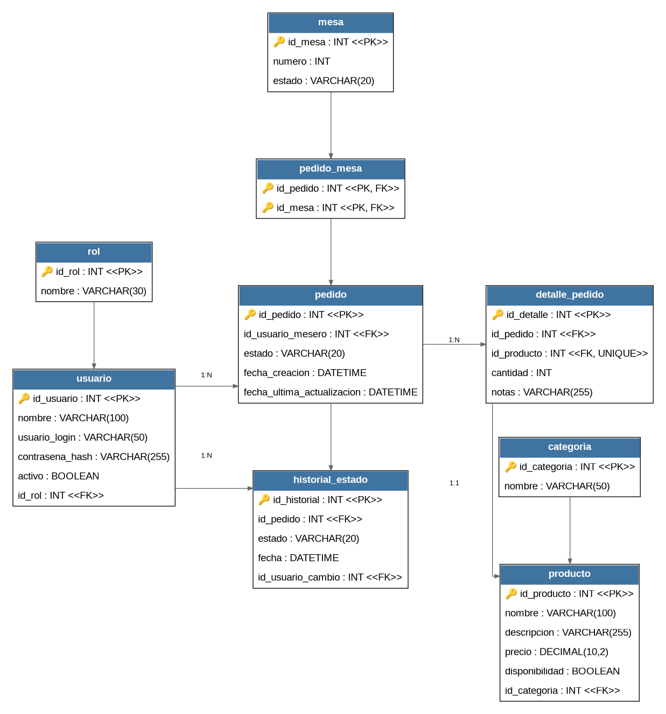

## 🛠️ Herramientas


# 🍽️ Sistema de Gestión de Pedidos

### 🎓 Proyecto de Desarrollo Web — Universidad Politécnico Grancolombiano

> 💡 Sistema web diseñado para facilitar la gestión de pedidos de un restaurante de forma organizada, sencilla y eficiente.

---

## 🚀 ¿Qué hace?

El sistema permite administrar los principales elementos de un restaurante:

- 👤 **Usuarios y roles**
- 🪑 **Mesas**
- 📋 **Pedidos**
- 🍔 **Productos y categorías**
- 🔄 **Estados e historial de pedidos**

Una de las características principales es que **un pedido puede estar asociado a varias mesas**, permitiendo manejar pedidos compartidos entre diferentes mesas.

También se registra el **historial de estados** de cada pedido para conocer su evolución y el usuario responsable de cada cambio.

---

## 🏗️ Estructura del sistema

```text
Usuario
   │
   ▼
Pedido ──────────► Historial_Estado
   │
   ├──► Pedido_Mesa ───► Mesa
   │
   └──► Detalle_Pedido ───► Producto ───► Categoría
```

### 🔗 Relaciones principales

- 👤 **Rol → Usuario:** un rol puede estar asignado a varios usuarios.
- 📋 **Usuario → Pedido:** un usuario puede gestionar varios pedidos.
- 🪑 **Pedido → Mesa:** un pedido puede estar asociado a una o varias mesas.
- 📝 **Pedido → Detalle:** un pedido puede contener diferentes detalles.
- 🍔 **Detalle → Producto:** cada detalle corresponde a un producto.
- 🗂️ **Categoría → Producto:** una categoría puede contener varios productos.
- 🔄 **Pedido → Historial:** un pedido puede tener varios registros de estado.

---

## 🪑 Pedido y mesas

Una característica importante del sistema es permitir que un mismo pedido pueda involucrar diferentes mesas.

```text
📋 PEDIDO #001
     │
     ├── 🪑 Mesa 4
     ├── 🪑 Mesa 5
     └── 🪑 Mesa 6
```

Para esto se utiliza la entidad intermedia `pedido_mesa`.

Esto permite una mayor flexibilidad en la gestión de pedidos y evita limitar cada pedido a una única mesa.

---

## 🔄 Historial de pedidos

Cada pedido puede pasar por diferentes estados durante su proceso:

```text
🟡 Pendiente
      ↓
🔵 En preparación
      ↓
🟢 Listo
      ↓
✅ Entregado
```

El sistema registra el estado, la fecha y el usuario responsable del cambio, permitiendo mantener la **trazabilidad del pedido**.

---

## 🍔 Productos

Los productos se organizan mediante categorías y contienen información como:

- 🏷️ Nombre
- 📝 Descripción
- 💰 Precio
- 📦 Disponibilidad
- 🗂️ Categoría

Esto permite mantener un catálogo organizado y facilitar su utilización dentro de los pedidos.

---

## 👤 Usuarios y roles

El sistema contempla diferentes roles para controlar las responsabilidades de los usuarios.

```text
🔐 Rol
   │
   └──► 👤 Usuario
```

La separación de roles permite establecer diferentes niveles de acceso y responsabilidades dentro del sistema.

---

## 📐 Diagramas

### 📊 Diagrama de Relacion



### 🏗️ Diagrama de Arquitectura


### ⚙️ Diagrama de Componentes


### 📦 Diagrama de Despliegue


## 📊 Entidades principales

| Entidad | Descripción |
|---|---|
| 👤 `usuario` | Usuarios que interactúan con el sistema |
| 🔐 `rol` | Roles de los usuarios |
| 🪑 `mesa` | Mesas disponibles |
| 📋 `pedido` | Información general de los pedidos |
| 🔗 `pedido_mesa` | Relación entre pedidos y mesas |
| 📝 `detalle_pedido` | Productos incluidos en cada pedido |
| 🍔 `producto` | Productos disponibles |
| 🗂️ `categoria` | Clasificación de productos |
| 🔄 `historial_estado` | Historial de cambios de los pedidos |

---

## 📈 Estado del proyecto

🚧 **En desarrollo**

### 📐 Análisis y diseño

- ✅ Levantamiento de requisitos
- ✅ Historias de usuario
- ✅ Modelo de datos
- ✅ Corrección de relaciones
- ✅ Diagrama de clases
- ✅ Diagrama de arquitectura

### 💻 Desarrollo

- ⬜ Frontend
- ⬜ Backend
- ⬜ Base de datos
- ⬜ Autenticación
- ⬜ Gestión de usuarios y roles
- ⬜ Gestión de mesas
- ⬜ Gestión de pedidos
- ⬜ Gestión de productos
- ⬜ Historial de estados

### 🧪 Pruebas

- ⬜ Pruebas funcionales
- ⬜ Pruebas de integración
- ⬜ Corrección de errores
- ⬜ 🚀 Despliegue

---
## 👥 Integrantes

- **Juan Miguel Parra Garzón**
- **Nicolas Abril Cárdenas**
- **Santiago Cortes Mojica**

## 🎓 Proyecto académico

**Universidad:** Politécnico Grancolombiano  
**Asignatura:** Desarrollo Web

