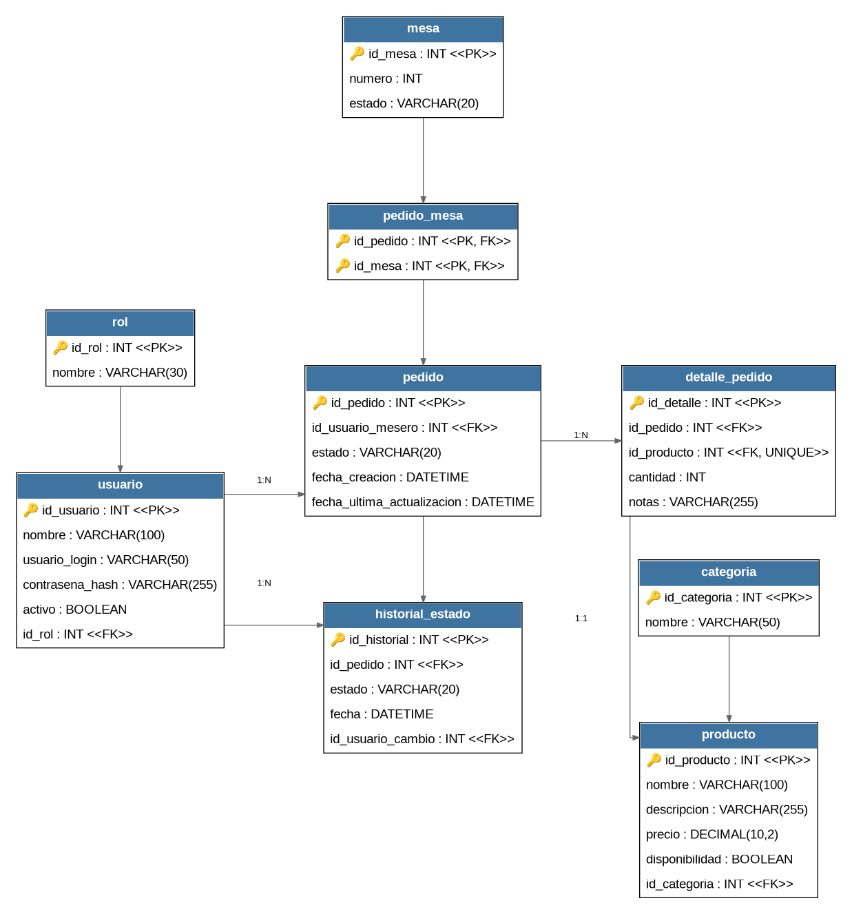

# 🍽️ Polirestaurante — Sistema de Gestión de Pedidos


Sistema web para gestionar los pedidos de un restaurante: desde que el mesero toma la orden en sala, pasando por la preparación en cocina, hasta la entrega y el análisis de ventas y tiempos.

🎓 Proyecto académico de la asignatura Desarrollo de Software, Politécnico Grancolombiano.

---

## 🚀 Características

- Gestión de usuarios con tres roles: mesero, cocina y administrador.
- Creación y edición de pedidos, con productos, cantidades y notas (por ejemplo, "sin cebolla").
- Un mismo pedido puede asociarse a varias mesas.
- Cola de pedidos para cocina, ordenada por fecha de creación y actualizada en tiempo real.
- Ciclo de estados controlado: Pendiente, En preparación, Listo, Entregado y Cancelado.
- Historial de estados inmutable, con fecha y usuario responsable de cada cambio.
- Administración de menú, categorías, mesas y usuarios.
- Reportes de ventas (por fechas, categoría y producto) y de tiempos de preparación.
- Autenticación y control de acceso por rol validado en el backend.

---

## 👥 Roles

| Rol | Qué puede hacer |
|---|---|
| 🧑‍🤝‍🧑 Mesero | Crear pedidos, agregar, modificar o quitar productos, marcar como entregado y cancelar |
| 🧑‍🍳 Cocina | Ver la cola de pendientes, iniciar la preparación y marcar pedidos como listos |
| 👨‍💼 Administrador | Gestionar menú, categorías, mesas y usuarios, y consultar reportes |

---

## 🔄 Flujo de un pedido

```text
🟡 PENDIENTE  ->  🔵 EN PREPARACIÓN  ->  🟢 LISTO  ->  ✅ ENTREGADO

Cualquier estado anterior a ENTREGADO  ->  ❌ CANCELADO
```

Reglas principales:

- Solo se pueden editar los productos de un pedido mientras está en estado Pendiente.
- Cocina solo puede pasar un pedido de Pendiente a En preparación, y de En preparación a Listo.
- Un pedido solo se marca como Entregado si está en estado Listo.
- Un pedido entregado no se puede cancelar.
- El estado de la mesa (libre u ocupada) cambia automáticamente al crear o cerrar un pedido.

---

## 🗃️ Modelo de datos

```text
rol ──► usuario ──► pedido ──► historial_estado
                      │
                      ├──► pedido_mesa ──► mesa
                      │
                      └──► detalle_pedido ──► producto ◄── categoria
```

| Entidad | Descripción |
|---|---|
| `rol` | Roles del sistema (administrador, cocina, mesero) |
| `usuario` | Usuarios, con su hash de contraseña y su rol |
| `mesa` | Mesas del restaurante y su estado |
| `pedido` | Pedido, mesero que lo creó, estado y fechas |
| `pedido_mesa` | Relación muchos a muchos entre pedidos y mesas |
| `detalle_pedido` | Productos, cantidades y notas de cada pedido |
| `producto` | Productos del menú con precio y disponibilidad |
| `categoria` | Clasificación de los productos |
| `historial_estado` | Registro de cada cambio de estado de un pedido |

---

## 🏗️ Arquitectura

El sistema está pensado en capas:

1. **Presentación:** interfaces web para mesero, cocina y administración, accesibles desde navegador en PC, tablet o celular.
2. **Lógica de negocio (API REST):** gestores de pedidos, reportes, usuarios y mesas, y menú, junto con el módulo de autenticación (JWT) y las notificaciones en tiempo real por WebSocket.
3. **Acceso a datos:** DAO para pedidos, historial de estados, usuarios y productos.
4. **Persistencia:** base de datos MySQL transaccional.

En despliegue, el navegador se comunica con el servidor de aplicaciones por HTTPS y WSS, y este con el servidor de base de datos por TCP/IP (puerto 3306).

---

## 📐 Diagramas

### Diagrama de clases



### Diagrama de arquitectura


### Diagrama de componentes


### Diagrama de despliegue


---

## 🛢️ Backend — Base de datos

El backend está implementado en **MySQL 8** mediante procedimientos almacenados, triggers y funciones.

El archivo `BackendPolirestaurante.rar` contiene:

| Archivo | Descripción |
|---|---|
| `backend.sql` | Esquema completo: tablas, triggers, funciones y procedimientos almacenados |
| `Prueba.sql` | Pruebas: flujo feliz (8 escenarios) y casos de error (13 escenarios) |

### Procedimientos por módulo

| Módulo | Operaciones |
|---|---|
| 🧑‍🤝‍🧑 Mesero | Crear pedido, agregar, modificar y quitar productos, marcar entregado, cancelar |
| 🧑‍🍳 Cocina | Ver cola, iniciar preparación, marcar listo |
| 👨‍💼 Administración | Gestionar menú, usuarios y categorías; reportes de ventas y tiempos |
| 🔐 Autenticación | Login con validación de hash bcrypt |

### 🔒 Seguridad

- Contraseñas almacenadas como hash bcrypt, nunca en texto plano.
- Control de acceso por rol validado en cada procedimiento.
- Historial de estados protegido por triggers para que no se pueda editar ni borrar.
- Transacciones en todas las operaciones críticas.

### ▶️ Cómo ejecutarlo

Requisitos: MySQL 8 y MySQL Workbench.

1. Descomprimir `BackendPolirestaurante.rar`.
2. Abrir `backend.sql` en Workbench y ejecutarlo con `Ctrl + Shift + Enter`.
3. Abrir `Prueba.sql` y ejecutarlo de la misma forma.
4. El script de pruebas debe terminar con un solo error (caso E1, intencional).

---

## 📈 Estado del proyecto

🚧 En desarrollo

- ✅ Levantamiento de requisitos e historias de usuario
- ✅ Modelo de datos y diagramas (clases, arquitectura, componentes y despliegue)
- ✅ Base de datos y backend en MySQL
- ✅ Autenticación, usuarios, roles, mesas, pedidos, productos e historial de estados
- ✅ Pruebas funcionales y de control de acceso
- ⬜ API REST y notificaciones en tiempo real
- ⬜ Frontend
- ⬜ Pruebas de integración
- ⬜ Despliegue

---

## 🤝 Integrantes

- Juan Miguel Parra Garzón
- Nicolas Abril Cárdenas
- Santiago Cortes Mojica

**Universidad:** Politécnico Grancolombiano
**Asignatura:** Desarrollo de Software
**Docente:** Yamid Ramírez
